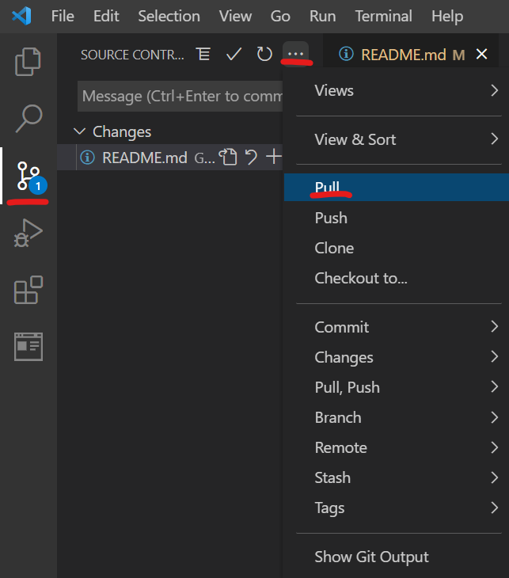
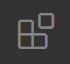
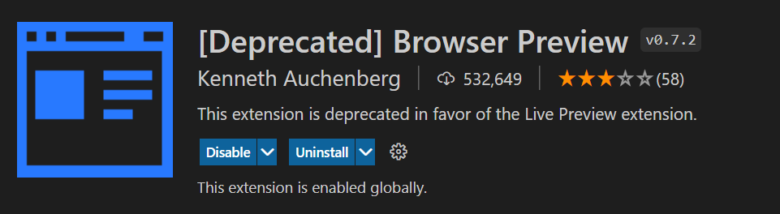
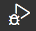

# Day 01
> Make sure to pull the git repo before doing the following
    

        
    

## Install Extension
1. Click on the extensions icon in the left hand side of VSC
    

        
    

2. Search for "Browser Preview" and install the extension 
    

        
    

## Pick a Job
Look at the pinned messages in the `#Web-Team` channel and choose a task that seems interesting to you.
## Learn HTML
1. Inside the `Caleb Powell` folder within the `User` folder, open the `Hello.html` file
2. Click the run and debug button on the left sidebar 
    

        
    

3. Select `Run and Debug` to view the HTML file in the browser and review some useful HTML info.

## Try it Yourself
Inside your user folder I would like to see some progress that you have made towards the task you chose by the end of next week (11/4/21). Remeber to PUSH YOUR CHANGES when done like we did in the setup process.