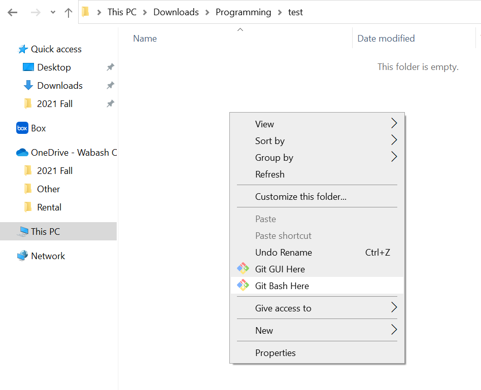
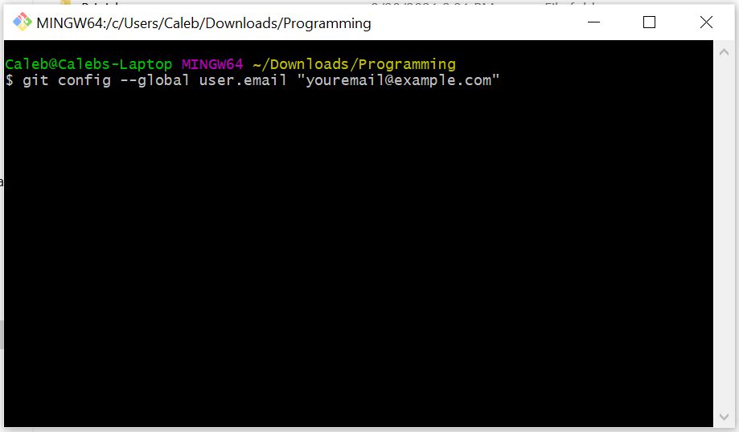
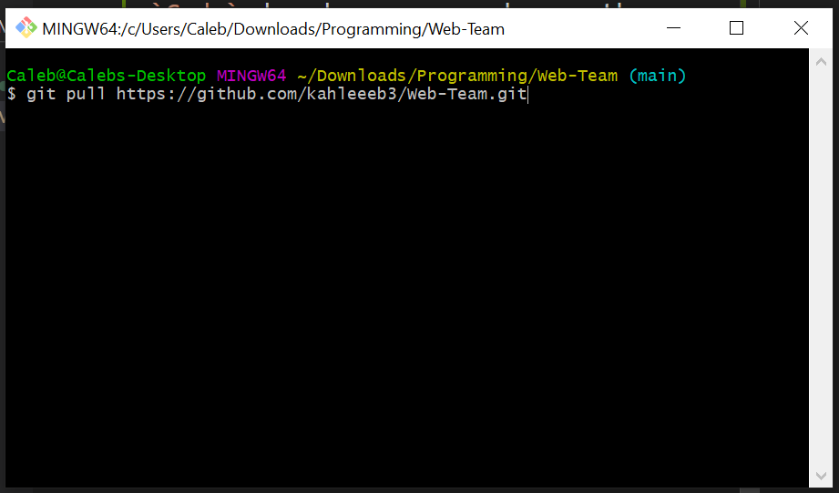
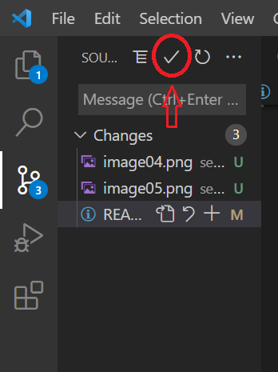
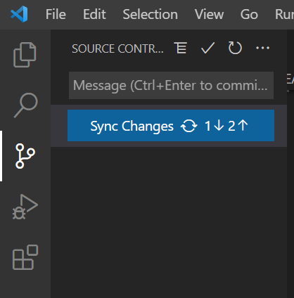

# How to Setup
## Recommended Software
This guide will assume you have the following installed on your local machine:
1. [Visual Studio Code](https://code.visualstudio.com/) IDE with built in git features.
2. [Git](https://git-scm.com/downloads) for moving files between Github and VSC
## Cloning the Repo (Copying Files)

1. Download/ Install [Git](https://git-scm.com/downloads) on your personal computer

2. Create a folder on your personal computer.

3. Right Click inside this folder and select the option `"Git Bash Here"` 
    <p align="center">
        
    </p>

4. In the terminal window type
    ```
    git config --global user.email "youremail@example.com"
    git config --global user.name "Your Name"
    ```
    <p align="center">
        
    </p>

5. In the git terminal, enter the following:
    ```
    git clone https://github.com/kahleeeb3/Web-Team.git 
    ```
    <p align="center">
        
    </p>

    A new `Web-Team` folder should have been created. Close the git terminal

## Edit Files in Repo

6. Open Visual Studio Code (VSC), select `File > Open Folder` and select the `Web-Team` folder created in Step 5.
7. Inside the `user` folder create a new folder named `Your Name` and place a random file in the folder.
8. In VSC, you should notice an icon on the left side bar with a notification icon. Select this icon.
    <p align="center">
        
    </p>
    Now, select the check mark above the changes section.
    <p align="center">
        
    </p>

    Select `Save All & Commit` if applicable and then type your name into the message box that appears.

9. Click the Blue `Sync Changes Button`. You should now be able to Refesh the [Web Repository](https://github.com/kahleeeb3/Web-Team/tree/main/user) and see the files added to your folder.
    <p align="center">
        
    </p>
